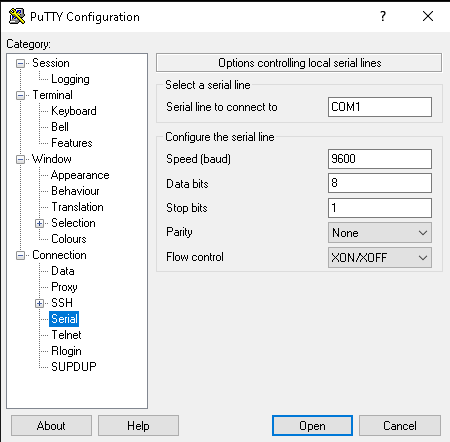
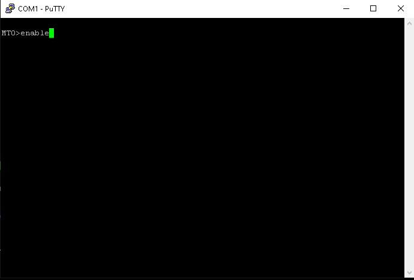

 # cisco-catalyst-switch-lab--2950-3550

# 🖧 Cisco Catalyst Switch Lab - 2950-3550

This repository contains my **hands-on labs using a Cisco Catalyst 2950 and 3550 switch**, demonstrating foundational switch management and configuration skills.  

While the creation of VLANs and setting up Trunking is demonstrated. Inter-VLAN routing is not implemented in this setup due to a single available subnet.

These are fairly older models, but serve as a great tool for practicing networking fundamentals.


---


## 📖 Overview

This lab walks through the full process of connecting to, factory resetting, configuring, and managing **Cisco Catalyst series switches** using the CLI via PuTTY Terminal Emulator.  

It covers console connectivity, factory resets, switch setup from scratch, VLAN management, port security, monitoring via SPAN, Spanning Tree Protocol - STP and Trunk port configuration.





---


## 🗂 Lab Demonstrations

  - Connecting to the Switch
  - Performing a Factory Reset
  - Configuring the Swtich from Scratch
  - Post Initial Setup
  - VLAN Creation and Managment
  - Port Security
  - SPAN - Switch Port Analyzer Configuration
  - Trunk Configuration
  - Spanning Tree Protocol (STP) Root Bridge Configuration


---


Key topics include:
- VLAN creation and port assignment
- Trunk configuration with a hardened Native VLAN
- Spanning Tree Protocol (STP) root bridge configuration
- SPAN (port mirroring) for traffic analysis

> **Note:** Due to lab constraints, all devices operate within a single IP subnet. Inter-VLAN routing is not demonstrated in this setup.


---


🖥️ **Live Project Webpages:**  
👉 [Cisco Catalyst Switch Lab 1](https://mark-thompson01.github.io/MTPortfolio/Skills/Labbing%20with%20a%20Cisco%20Catalyst%202950%20Switch/)

👉 [Cisco Catalyst Switch Lab 2](https://mark-thompson01.github.io/MTPortfolio/Skills/Cisco%20STP%20Trunking%20Lab/)


---


## Topology
**Switch 1:** Cisco Catalyst 2950 (Layer 2) – VLAN creation, access port assignments, SPAN configuration

**Switch 2:** Cisco Catalyst 3550 (Layer 3-capable) – Trunking, STP root bridge

**VLAN Plan:**
| VLAN ID | Name   | Purpose         |
|---------|--------|-----------------|
| 1       | default | Management      |
| 10      | Lab-1  | Experiment      |
| 20      | Lab-2  | Workstations    |
| 99      | Native | Native VLAN for trunk |

---

## Key Commands for Verification
```bash
show vlan brief
show interfaces trunk
show spanning-tree vlan 10
show spanning-tree vlan 20
show monitor session 1
```

---


## 🎯 Purpose

The purpose of this lab is to:

- Gain hands-on experience configuring and managing a **Cisco Catalyst Series switches**  
- Learn and practice:
  - Basic switch setup
  - VLAN creation and port assignments
  - Securing access via passwords and port security
  - Using SPAN (port mirroring) to capture and analyze traffic
- Build familiarity with the **Cisco IOS CLI**, a critical skill for networking and CCNA studies.


---


## 🛠️ Tech Used

- Cisco Catalyst 2950 and 3550 managed switches
- DB9 serial to console port cable
- Crossover Cable for Trunk port configuration
- PuTTY terminal emulator
- Windows Desktop
- Wireshark


---


## 🔧 Recreating These Labs

To follow along or recreate these Cisco switch projects:

1. **Get the equipment**  
   - Two Cisco Catalyst switches (e.g., 2950 & 3550)  
   - *Or use Cisco Packet Tracer / Cisco Modeling Labs (CML) for a virtual setup*  

2. **Connect to each switch via console**  
   - Use PuTTY or another terminal emulator  

3. **Perform a factory reset**  
   ```bash
   flash_init
   del flash:config.text
   del flash:vlan.dat
   boot
   ```

4. **Setup and configure VLANs**

5. **Setup and configure Trunk port**
   
6. **Setup and configure Spanning Tree Protocol - STP - Bridge Port**
   
7. **Setup and configure SPAN port - Switch Port Analyzer** 


---


## 📘 What I’ve Learned

- Managed network switch navigation and configuration via PuTTY
- Cisco command-line modes and how to navigate them
- How to factory reset a legacy Cisco Catalyst switch
- Basic switch configurations
- Creating VLANs and assigning switch ports to them
- How to configure a SPAN port - Switch Port Analyzer
- How to use Wireshark to capture and analyze network traffic from SPAN source ports
- How to configure a VLAN trunk port
- How to configure Spanning-Tree-Protcol - STP - root bridge


## 📁 More from Me

Visit my full GitHub Pages portfolio to explore additional projects:

🔗 [MTPortfolio – Full Project Index](https://mark-thompson01.github.io/MTPortfolio/)


---


📄 **License**  
This content is licensed under the [Creative Commons Attribution 4.0 International (CC BY 4.0)](https://creativecommons.org/licenses/by/4.0/)


